# TraceChain Guided SCORM: Hướng dẫn có chú giải dành cho giảng viên

> **Bản dành cho giảng viên — tiết lộ toàn bộ đáp án và báo cáo cuối.**
>
> Đây không phải là tài liệu phát cho người học. Tài liệu này trình bày bằng
> chứng, các quyết định đúng, trình tự giao dịch và quan hệ nhân quả của tình
> huống Guided.

## 1. Tài liệu này ghi lại điều gì?

Hướng dẫn này được tạo bằng cách hoàn thành hoạt động **TraceChain Guided**
SCORM đã triển khai trên Moodle demo cục bộ. Các màn hình không được dựng lại từ
mã nguồn. Mọi ảnh chụp và giá trị dưới đây đều đến từ một lượt học Moodle liên
tục, hoàn thành ngày 28 tháng 7 năm 2026.

| Thuộc tính của lượt học | Giá trị quan sát được |
|---|---|
| Hoạt động Moodle | TraceChain Guided |
| Cấu hình định sẵn | Guided |
| Ngôn ngữ | Tiếng Việt |
| Kịch bản | `SCN_COFFEE_001@2.3.0` |
| Hạt giống kịch bản | `guided-standard-v1` |
| Chính sách biến thể | Tình huống cố định; thứ tự phương án cố định; ổn định trong suốt lượt học |
| Hàm băm cấu hình | `c7c3c3236c7a2dae18aa8499dcef70df0a1a460b0a74e9bccec5f48490942a40` |
| Thời lượng dự kiến | 40 phút |
| Điểm đạt | 70/100 |
| Kết quả hoàn thành | 100/100, đạt |
| Số gợi ý đã mở | 0 |
| Giao dịch đã được ghi vào sổ cái | 14 |
| Số khối | 14 |
| Giao dịch sổ cái bị từ chối | 0 |
| Bản ghi cần xem xét thủ công khi thu hồi | 0 |
| Kết quả Moodle | Lượt 1, điểm 100%, điểm báo cáo 100% |

Lượt học này đi theo nhánh được biên soạn tốt nhất để các ảnh chụp tạo thành
một tài liệu tham chiếu rõ ràng. Hướng dẫn vẫn giải thích các đường dẫn sai có ý
nghĩa sư phạm, nhưng không cố ý làm giảm điểm cuối.

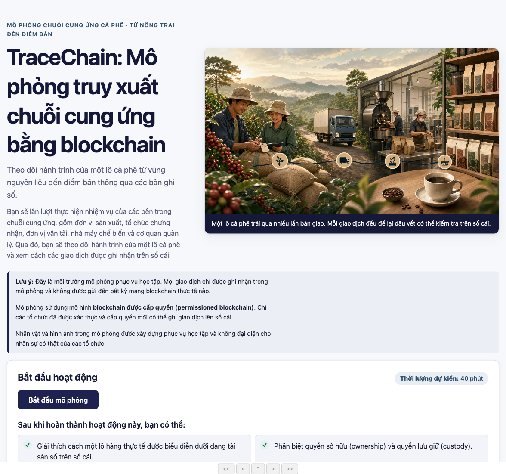

## 2. Giảng viên có thể sử dụng tài liệu này như thế nào?

Tài liệu hỗ trợ bốn mục đích thực tế:

1. **Chuẩn bị trước giờ học.** Xem trước bằng chứng và các ngộ nhận có thể xảy
   ra trước khi giao hoạt động.
2. **Điều phối trực tiếp.** Tạm dừng tại các câu hỏi thảo luận được đề xuất mà
   không tiết lộ đáp án tiếp theo.
3. **Thảo luận sau hoạt động.** So sánh lập luận của người học với chuỗi nhân
   quả trình bày trong tài liệu.
4. **Giải thích kỹ thuật.** Dùng giao dịch, hàm băm, chữ ký, xác nhận, phiên bản
   trạng thái và bằng chứng nguồn gốc thực tế để giải thích phần nào là thật và
   phần nào được mô phỏng.

Tình huống đặt quyết định nghiệp vụ ở vị trí trung tâm. Người học không phải
quản lý khóa riêng, chọn thuật toán, đào khối hay vận hành nút mạng. Người học
đưa ra quyết định về chuỗi cung ứng và quản trị; TraceChain hiển thị bằng chứng
kỹ thuật cần thiết để hiểu tại sao một quyết định được chấp nhận hoặc từ chối.

## 3. Mô hình khái niệm phía sau các màn hình

### 3.1 Bốn loại trạng thái khác nhau

Tình huống sẽ dễ giảng dạy hơn nếu bốn khái niệm sau luôn được phân biệt:

| Khái niệm | Ý nghĩa trong tình huống |
|---|---|
| Thực tế vật lý | Cà phê, khối lượng đo được, số liệu cảm biến, nội dung chứng nhận và tình trạng nhiễm bẩn tồn tại bên ngoài sổ cái. |
| Trạng thái nghiệp vụ | Tổ chức nào sở hữu hoặc lưu giữ lô hàng; lô hàng được phép bán, đã dùng để chuyển đổi, đang chờ xem xét hay đã thu hồi. |
| Lịch sử sổ cái | Các giao dịch và khối được chấp nhận theo nguyên tắc chỉ ghi thêm, bao gồm vận đơn sai ban đầu và giao dịch điều chỉnh sau đó. |
| Trạng thái thông tin | Thông tin mà vai trò hiện tại được phép xem tại thời điểm đó. |

Tính toàn vẹn của blockchain không làm cho cột đầu tiên tự động đúng sự thật.
Blockchain cung cấp bằng chứng mạnh hơn về việc ai đã phê duyệt nội dung số cụ
thể, nội dung được ghi nhận khi nào, thay đổi ra sao và việc sửa đổi sau đó có
thể bị phát hiện hay không.

### 3.2 Đường đi của một giao dịch

Quy trình giao dịch hiển thị trên màn hình tương ứng với chuỗi khái niệm sau:

```text
Quyết định nghiệp vụ
→ lệnh được tạo trong ngữ cảnh người thực hiện tin cậy
→ đề xuất chuẩn hóa và mã băm đề xuất
→ kiểm tra chữ ký Ed25519
→ đánh giá danh tính và thẩm quyền
→ đánh giá chính sách xác nhận, nếu có
→ kiểm tra phiên bản trạng thái và quy tắc nghiệp vụ
→ sắp thứ tự
→ ghi vào khối
→ dựng trạng thái hiện tại
```

Không điều khiển React nào có thể tự khai báo rằng nó đã được xác minh hoặc
được cấp quyền. Người học có thể yêu cầu một bước bàn giao vai trò được kịch bản
cho phép, nhưng không thể tự nhập tổ chức hoặc vai trò vào nội dung lệnh.

### 3.3 Phần mật mã nào là thật?

Các phép tính thật trong gói gồm:

- hàm băm SHA-256 của giao dịch, khối, trạng thái tài sản và nội dung tài liệu
- tuần tự hóa chuẩn
- liên kết hàm băm giữa các khối
- ký và kiểm tra chữ ký Ed25519
- chữ ký của nhiều tổ chức học tập trên cùng một đề xuất
- đánh giá chính sách xác nhận
- kiểm tra phiên bản trạng thái rõ ràng

Các nội dung được mô phỏng rõ ràng cho mục đích học tập gồm:

- việc cấp và công nhận danh tính tổ chức
- việc lưu giữ khóa riêng học tập đi kèm gói
- hạ tầng cơ quan chứng thực và cấp chứng thư
- truyền thông mạng, các nút, dịch vụ sắp thứ tự và đồng thuận

Sổ cái cà phê chính không có bằng chứng công việc, đào, tiền mã hóa hay cây
Merkle.

### 3.4 Chữ ký hợp lệ không đồng nghĩa với có thẩm quyền hoặc đúng sự thật

Bảng tóm tắt độ tin cậy cố ý tách riêng các câu hỏi:

```text
Chữ ký có hợp lệ không?
Danh tính có được công nhận không?
Khóa có đang hoạt động không?
Tổ chức và vai trò có thẩm quyền không?
Chính sách xác nhận có được đáp ứng không?
Tuyên bố nghiệp vụ có đúng sự thật không?
```

Một đơn vị vận tải có thể tạo chữ ký Ed25519 thật và hợp lệ nhưng vẫn không có
thẩm quyền cấp chứng nhận chất lượng. Ngay cả một chữ ký hợp lệ và đúng thẩm
quyền cũng không chứng minh rằng tuyên bố được ký là đúng sự thật.

## 4. Hợp đồng điểm và gợi ý

Tổng điểm được công bố vẫn chính xác là 100:

- **39 điểm thao tác** cho tám hành động nghiệp vụ bắt buộc
- **61 điểm kiến thức** cho chín câu hỏi có điểm
- một câu hỏi định hướng ban đầu có giá trị 0 điểm

### 4.1 Các mục thao tác: 39 điểm

| Mã mục có điểm | Hành động | Điểm | Gợi ý áp dụng riêng cho mục |
|---|---|---:|---|
| `INT_CREATE_BATCH` | Tạo lô cà phê nhân ban đầu | 4 | Các trường tạo lô |
| `INT_RECEIVE_BATCH` | Tiếp nhận lô tại nhà máy chế biến | 3 | Không |
| `INT_CORRECTION_RECORDED` | Cam kết giao dịch điều chỉnh số lượng chỉ ghi thêm | 10 | Cơ chế điều chỉnh |
| `INT_TRANSFORM_BATCH` | Chuyển đổi cà phê nhân thành cà phê rang | 4 | Hiệu suất chuyển đổi |
| `INT_PACKAGE_BATCH` | Đóng gói cà phê rang | 3 | Không |
| `INT_OWNERSHIP_TRANSFER_SCOPE` | Chuyển quyền sở hữu mà không làm sai bên lưu giữ | 5 | Không |
| `INT_DISPATCH_BATCH` | Giao lô thành phẩm | 5 | Không |
| `INT_RECALL_COMMITTED` | Cam kết lệnh thu hồi đúng thẩm quyền | 5 | Không |
| **Tổng** |  | **39** |  |

### 4.2 Các mục kiến thức: 61 điểm

| Mã mục có điểm | Nội dung phán đoán | Điểm | Gợi ý áp dụng riêng cho mục |
|---|---|---:|---|
| `INT_CERTIFICATE_STORAGE_CHOICE` | Tài liệu đầy đủ ngoài chuỗi, hàm băm trên chuỗi | 5 | Lưu trữ chứng nhận |
| `INT_CERTIFICATE_ISSUER_CHECK` | Sự công nhận và thẩm quyền của đơn vị cấp | 5 | Không |
| `INT_CUSTODY_TRANSFER_SCOPE` | Quyền lưu giữ thay đổi nhưng quyền sở hữu giữ nguyên | 6 | Quyền lưu giữ và quyền sở hữu |
| `INT_TRANSPORT_CONDITION` | Phản ứng tương xứng với dữ liệu cảm biến vượt ngưỡng | 5 | Không |
| `INT_TRANSFORMATION_PROVENANCE` | Tài sản mới liên kết với đầu vào, không thay thế lịch sử đầu vào | 8 | Không |
| `INT_TAMPER_DEMONSTRATION` | Phát hiện sửa đổi và ngăn chặn sửa đổi | 7 | Không |
| `INT_DATA_GOVERNANCE_CLASSIFICATION` | Trên chuỗi, ngoài chuỗi, hạn chế truy cập hoặc không thu thập | 5 | Không |
| `INT_RECALL_SCOPE` | Chỉ chọn các lô hậu duệ theo quan hệ nguồn gốc | 15 | Nguồn gốc phục vụ thu hồi |
| `INT_BLOCKCHAIN_NECESSITY` | Xác định trường hợp sử dụng phù hợp giữa nhiều tổ chức | 5 | Không |
| **Tổng** |  | **61** |  |

Mở gợi ý chỉ giới hạn điểm của mục được khai báo là đích, thông thường ở mức
70%. Gợi ý không phạt toàn bộ bước. Trước khi người học mở gợi ý, giao diện tính
và công bố số điểm có thể bị ảnh hưởng theo trạng thái hiện tại. Khắc phục sau
đó không thể phục hồi phần điểm đã bị giới hạn do mở gợi ý.

Báo cáo cuối nhóm lại cùng 100 điểm đó thành sáu thành phần theo năng lực:

| Thành phần trong báo cáo cuối | Điểm tối đa |
|---|---:|
| Ghi giao dịch chính xác | 25 |
| Truy xuất đầy đủ | 20 |
| Quản trị dữ liệu | 15 |
| Tuân thủ và điều chỉnh | 15 |
| Hiệu quả thu hồi | 20 |
| Hiểu khái niệm | 5 |

## 5. Bảng tra cứu

Bảng tra cứu **Bảng tra cứu** luôn có thể mở trong suốt hoạt động. Bảng gồm năm
thẻ.

### 5.1 Trạng thái hiện tại

Trạng thái hiện tại là phép dựng từ lịch sử sự kiện được chấp nhận. Nó thuận
tiện để xem nhanh nhưng không thay thế lịch sử đã tạo ra trạng thái đó. Mỗi tài
sản có thể thay đổi đều có phiên bản rõ ràng; phiên bản tăng khi một giao dịch
được chấp nhận làm thay đổi tài sản.

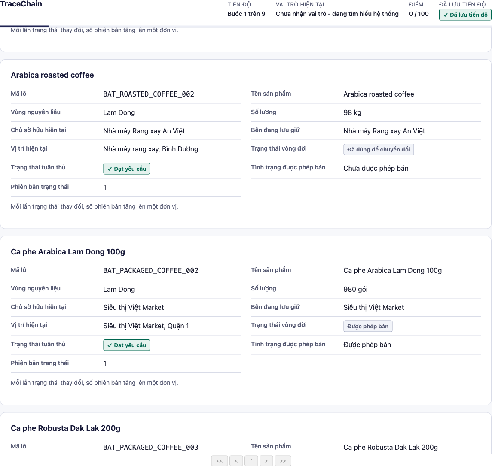

Kịch bản có sẵn các lô gây nhiễu ngay từ đầu. Chúng đặc biệt quan trọng ở Bước 9
vì tên, ngày, nhà sản xuất hoặc nhà máy giống nhau không chứng minh quan hệ nguồn
gốc.

Chuỗi gây nhiễu ban đầu:

```text
BAT_GREEN_COFFEE_002, 120 kg
→ BAT_ROASTED_COFFEE_002, 98 kg
→ BAT_PACKAGED_COFFEE_002, 980 gói
```

Một lô gây nhiễu không liên quan khác là `BAT_PACKAGED_COFFEE_003`, cà phê
Robusta Đắk Lắk 200 g, 400 gói.

### 5.2 Lịch sử giao dịch

Khi bắt đầu, người học chưa tạo giao dịch mới nào.


Khi kết thúc, lịch sử có 14 giao dịch được chấp nhận.

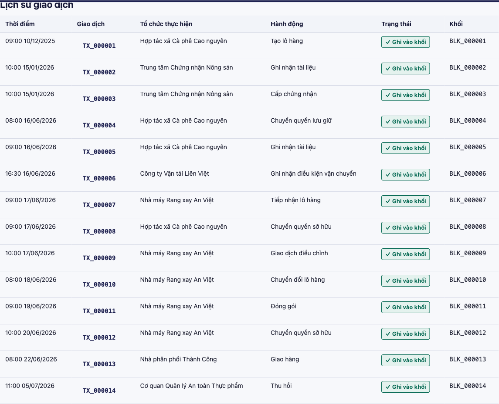

### 5.3 Sổ cái

Thẻ sổ cái hiển thị khối, giao dịch, hàm băm khối trước, hàm băm khối và trạng
thái toàn vẹn. Các giá trị SHA-256 được hiển thị được tính trong trình duyệt từ
chính các bản ghi.

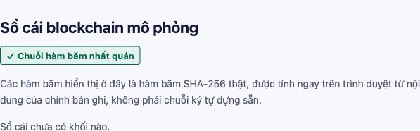

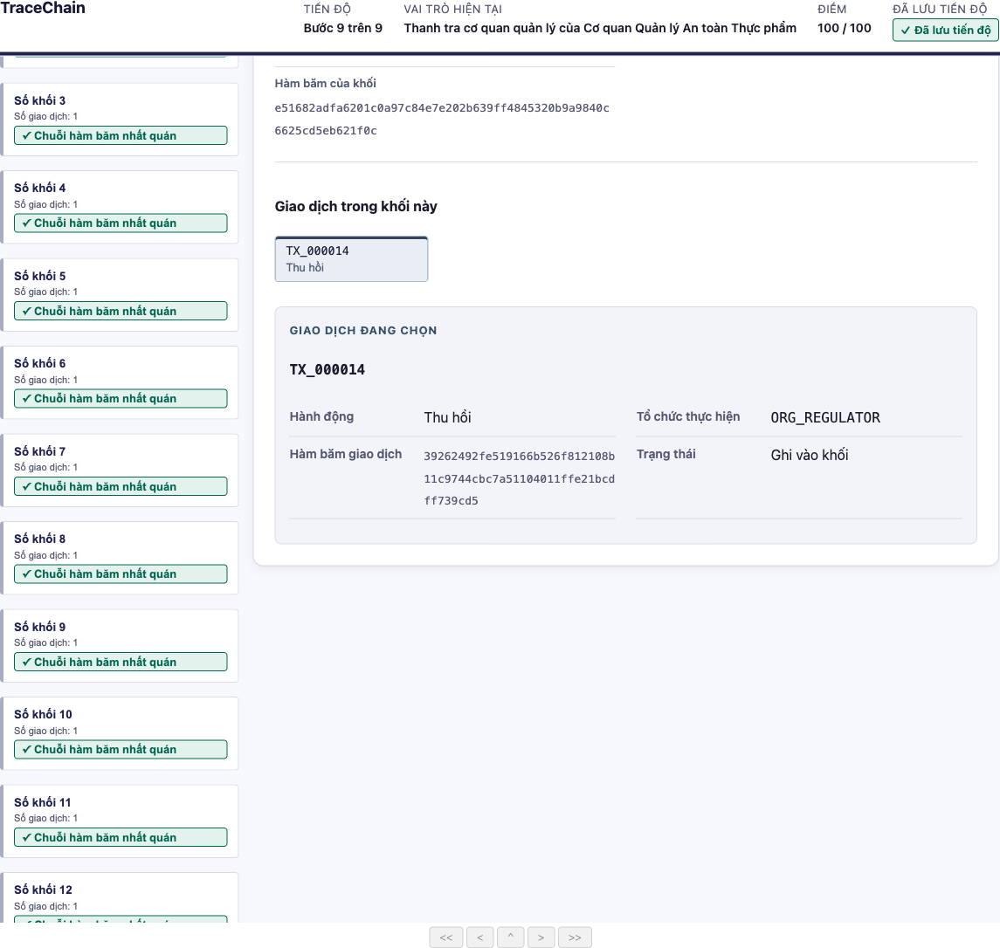

### 5.4 Truy xuất nguồn gốc

Quan hệ nguồn gốc thể hiện cách một tài sản được chuyển đổi hoặc đóng gói thành
tài sản khác. Các mũi tên đi từ tài sản cũ đến tài sản mới.

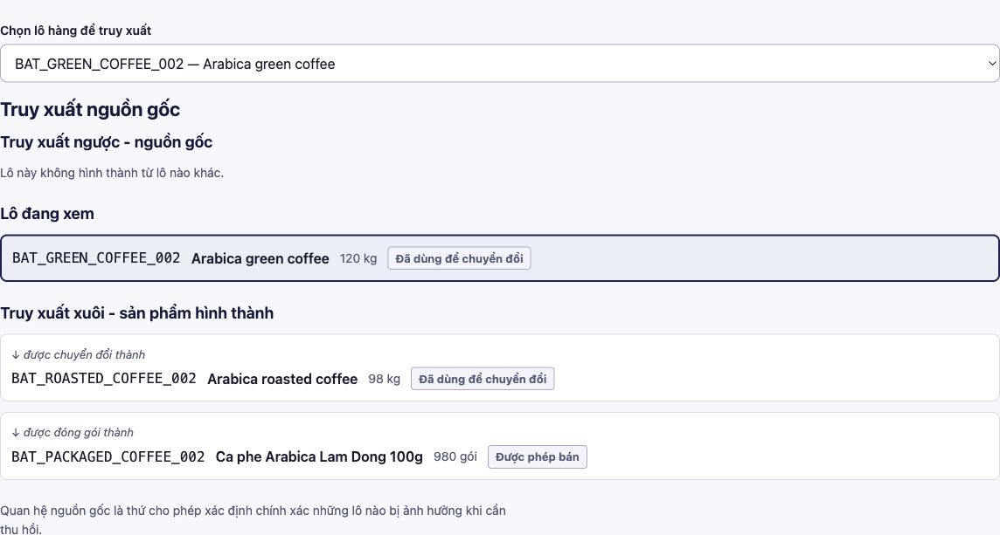

### 5.5 Thuật ngữ

Bảng thuật ngữ giải thích giao dịch, khối, hàm băm, sổ cái, trạng thái thế giới,
hợp đồng thông minh, quyền sở hữu, quyền lưu giữ, nguồn gốc, xác nhận, dịch vụ
sắp thứ tự, oracle và blockchain có cấp quyền.

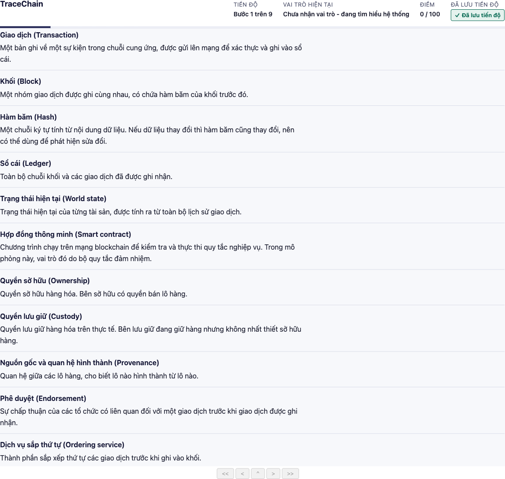

## 6. Hướng dẫn theo từng bước

## Bước 1 — Làm quen với mạng blockchain mô phỏng

### Nhiệm vụ của người học

Người học làm quen với các tổ chức và thiết lập hiểu biết ban đầu về điều bằng
chứng blockchain có thể và không thể chứng minh.

Các tổ chức xuất hiện trong tình huống:

- Hợp tác xã Cà phê Cao nguyên
- Trung tâm Chứng nhận Nông sản
- Công ty Vận tải Liên Việt
- Nhà máy Rang xay An Việt
- Nhà phân phối Thành Công
- Siêu thị Việt Market

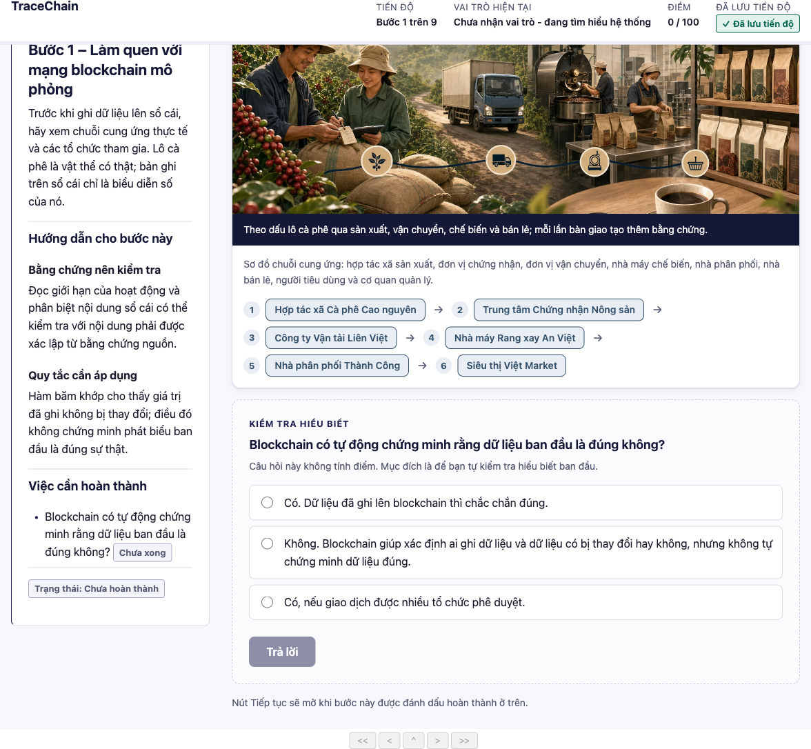

### Lập luận đúng

Phát biểu đúng là sổ cái có thể giúp xác định:

- ai đã ghi một tuyên bố
- tuyên bố được ghi khi nào
- nội dung đã ghi có bị thay đổi sau đó hay không

Sổ cái không thể chứng minh tuyên bố ban đầu là đúng. Đây là mục chẩn đoán có
giá trị 0 điểm.

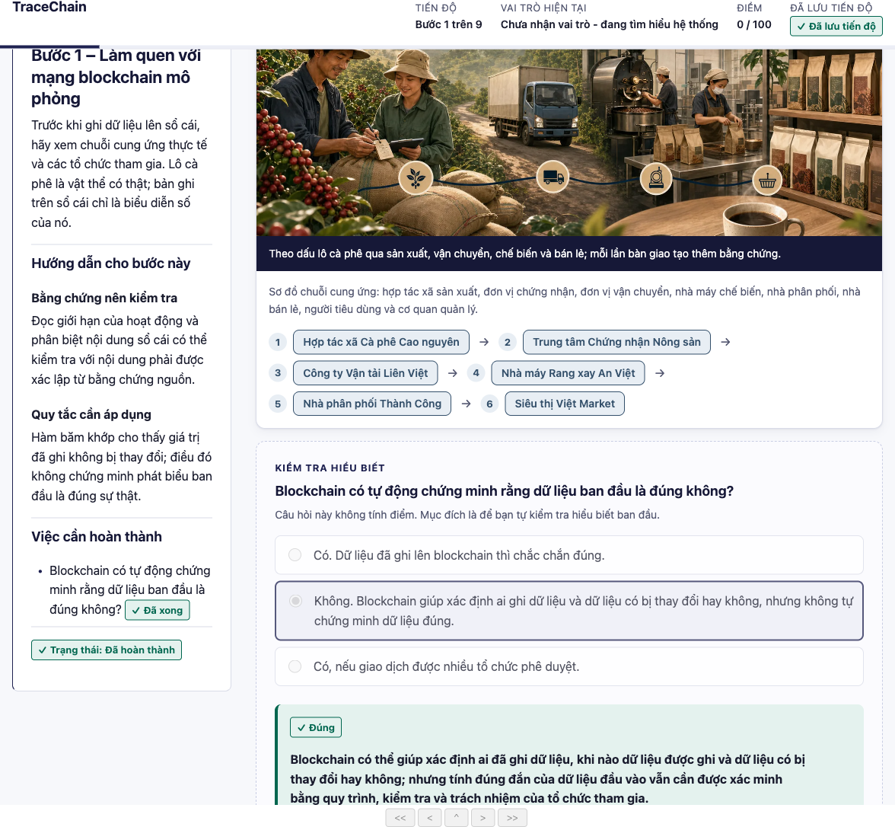

### Lý thuyết cần nhấn mạnh

Nguyên tắc “dữ liệu rác vào thì kết quả rác ra” vẫn đúng. Một bản ghi có thể
phát hiện sửa đổi nhưng chứa tuyên bố sai thì vẫn là tuyên bố sai. Vì vậy,
TraceChain xem tài liệu nguồn, thẩm quyền vai trò, dữ liệu cảm biến, đo lường vật
lý và điều tra là một phần của quyết định, thay vì coi sổ cái như nguồn chân lý.

### Câu hỏi thảo luận

> Nếu ba tổ chức cùng đồng ý rằng một con số sai đã được nhập, sự đồng thuận đó
> có làm con số trở thành đúng không? Cần bằng chứng gì để điều chỉnh?

## Bước 2 — Tạo lô cà phê nhân

### Vai trò và bằng chứng

Người học đóng vai **Nguyễn Thị Mai**, quản lý sản xuất nông trại của Hợp tác xã
Cà phê Cao nguyên.

Dữ liệu nghiệp vụ được gửi:

| Trường | Giá trị |
|---|---|
| Mã tài sản | `BAT_GREEN_COFFEE_001` |
| Sản phẩm | Arabica green coffee |
| Nguồn gốc | Lâm Đồng |
| Số lượng | 100 kg |
| Chủ sở hữu | Hợp tác xã Cà phê Cao nguyên |
| Bên lưu giữ | Hợp tác xã Cà phê Cao nguyên |

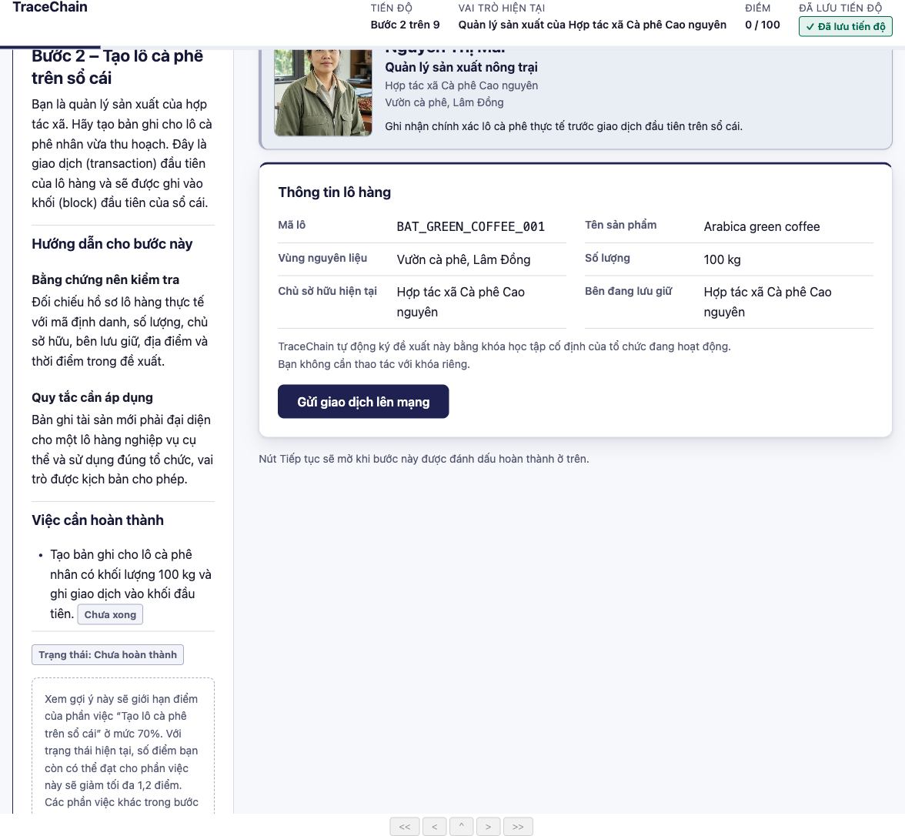

### Hệ thống kiểm tra điều gì?

Đề xuất được ký bằng khóa học tập cố định của tổ chức đang hoạt động. Bảng tóm
tắt độ tin cậy và tiến trình giao dịch cho thấy chữ ký hợp lệ chỉ là một phần
của điều kiện chấp nhận.

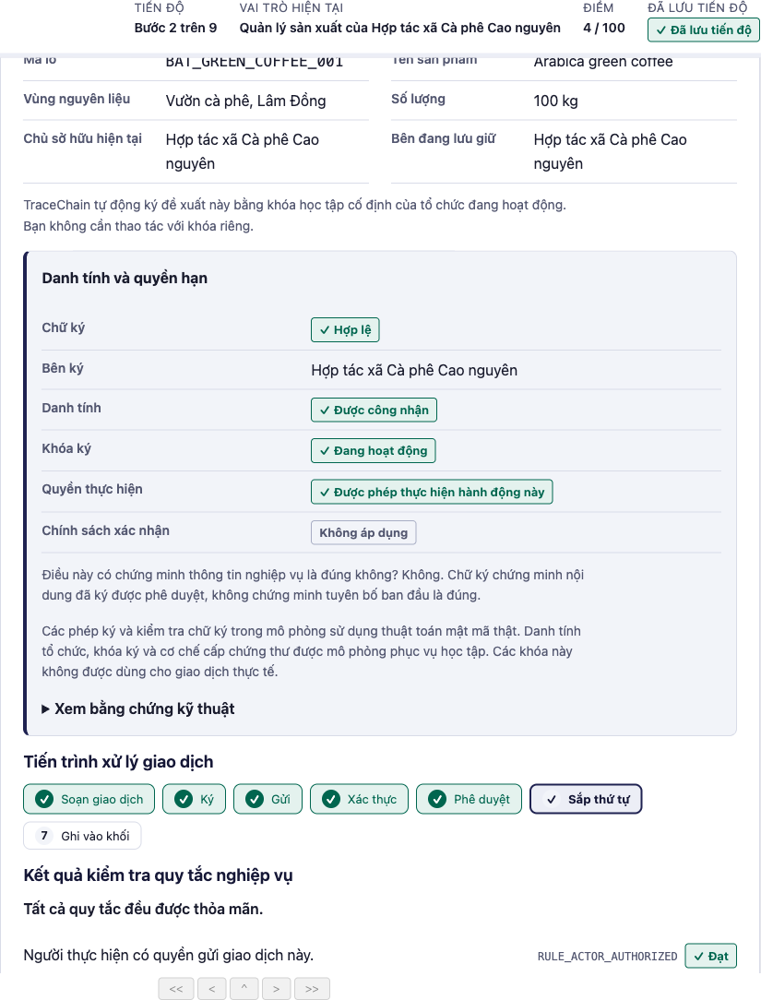

Các quy tắc quan sát được gồm:

- `RULE_ACTOR_AUTHORIZED`
- `RULE_ORGANIZATION_ACTIVE`
- `RULE_ASSET_ID_UNIQUE`
- `RULE_VALID_QUANTITY`
- `RULE_UNIT_COMPATIBLE`
- `RULE_TIMESTAMP_SEQUENCE_VALID`

### Kết quả được chấp nhận

- giao dịch: `TX_000001`
- khối: `BLK_000001`
- thời điểm sắp thứ tự: 09:00, ngày 10 tháng 12 năm 2025
- phiên bản tài sản sau giao dịch: 1
- SHA-256 giao dịch:
  `058d40c47f0c387e7b6dd4fb0625fe8fe8dac84e0059df6ff290dc6dd2771fac`
- SHA-256 khối:
  `8332cf18d8363ded1174b1b2cd484c5ae4542ce2ef77466149adc495e9553ca3`

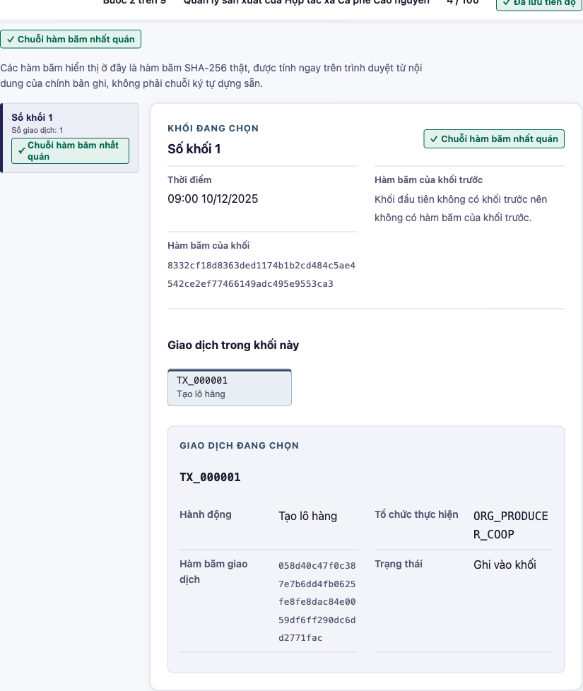

### Lý thuyết cần nhấn mạnh

Mã tài sản đại diện cho bản biểu diễn số của một lô vật lý. Tính duy nhất, đơn
vị, thời điểm và thẩm quyền người thực hiện là các quy tắc nghiệp vụ. Hàm băm bảo
vệ tính toàn vẹn của bản ghi số được chấp nhận; hàm băm không cân cà phê.

## Bước 3 — Ghi nhận và đánh giá chứng nhận chất lượng

Đây là bài học chính về chữ ký, thẩm quyền, quản trị tài liệu và quyết định có
hệ quả lâu dài.

### Vai trò

Người học đóng vai **Trần Minh Anh**, cán bộ chứng nhận tại Trung tâm Chứng nhận
Nông sản.

### Tài liệu nguồn

| Trường | Giá trị thực tế trong tình huống |
|---|---|
| Lô | `BAT_GREEN_COFFEE_001` |
| Tên tệp | `giay-chung-nhan-chat-luong-001.pdf` |
| Đơn vị cấp | Trung tâm Chứng nhận Nông sản |
| Ngày cấp/xem xét | `2026-01-15T03:00:00.000Z` |
| Ngày hết hạn | `2027-01-15T03:00:00.000Z` |
| SHA-256 tài liệu | `8641384af29fce9efb2a58cf7e87cf374e6216ef0a50a1633e3b08cf8a11ff5a` |

Sổ đăng ký tổ chức của mạng xác định `ORG_CERTIFICATION_BODY` là tổ chức được
công nhận, đang hoạt động và được phép cấp chứng nhận chất lượng theo chính sách
mạng phiên bản 2.3.0.

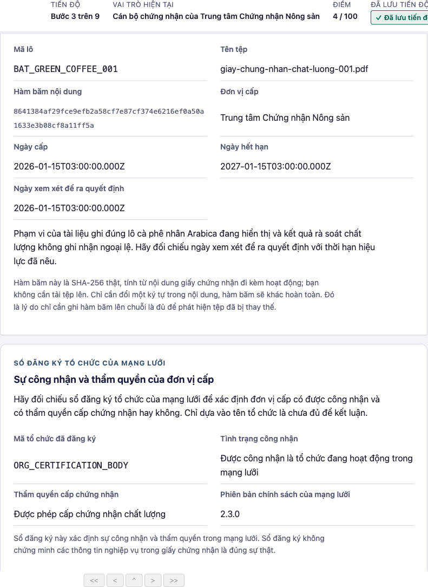

### Quyết định nguyên tử có hệ quả

Người học cam kết một quyết định có cấu trúc, gồm tất cả các phán đoán:

- nội dung chứng nhận: hợp lệ
- đơn vị cấp: được công nhận và có thẩm quyền
- lưu trữ: tài liệu đầy đủ ngoài chuỗi, SHA-256 trên chuỗi
- xử lý lô: cho phép tiếp tục

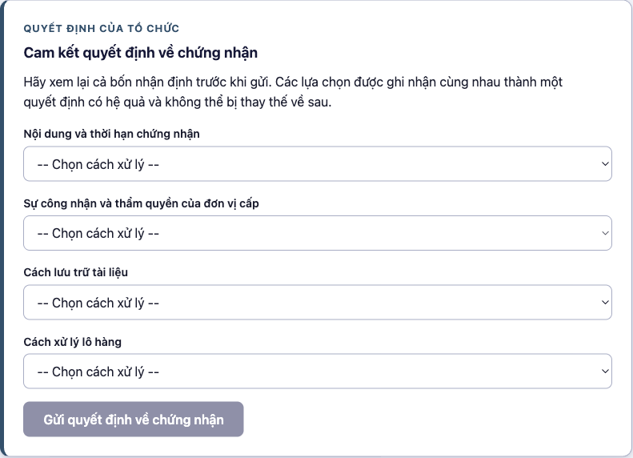

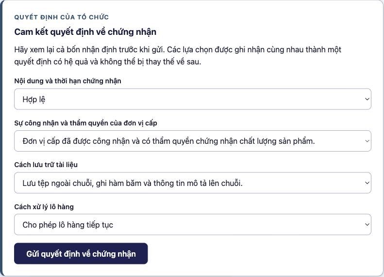

Sau khi gửi, các điều khiển ban đầu trở thành chỉ đọc. Lịch sử không bị viết lại
bởi bước khắc phục sau đó.

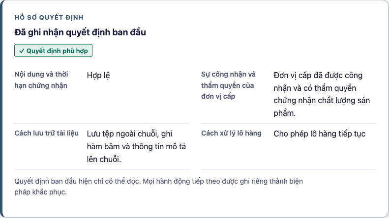

### Vì sao lựa chọn lưu trữ quan trọng?

Lưu toàn bộ tài liệu trên mọi bản sao của liên minh tạo ra vấn đề về bảo mật,
lưu giữ và điều chỉnh. Lưu tài liệu trong kho ngoài chuỗi phù hợp, đồng thời ghi
SHA-256 lên chuỗi, cho phép người dùng sau này kiểm tra tệp được truy xuất có
đúng là tệp đã được phê duyệt hay không.

### Chữ ký hợp lệ nhưng hành động không được phép

Bước này cố ý minh họa một đơn vị vận tải ký hành động cấp chứng nhận. Chữ ký
Ed25519 là thật và hợp lệ, tổ chức được công nhận, nhưng đơn vị vận tải không có
thẩm quyền cấp chứng nhận chất lượng.

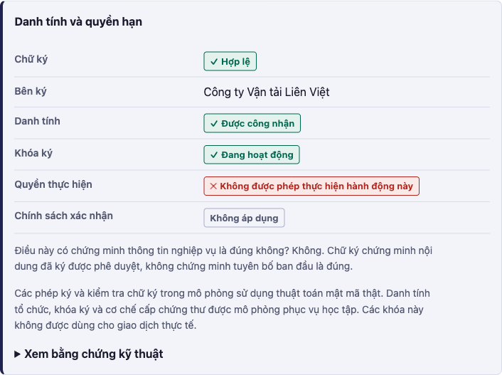

Lần gửi không hợp lệ này được giữ làm bằng chứng kiểm toán. Nó không:

- đi vào một khối
- thay đổi phiên bản tài sản
- làm thay đổi hàm băm giao dịch hoặc khối
- xuất hiện như giao dịch nghiệp vụ được chấp nhận
- được giảm thành trạng thái tài sản hiện tại

### Cam kết chứng nhận đúng thẩm quyền

Trong vai trò cán bộ chứng nhận tin cậy, chữ ký, danh tính, khóa đang hoạt động
và thẩm quyền đều đạt.

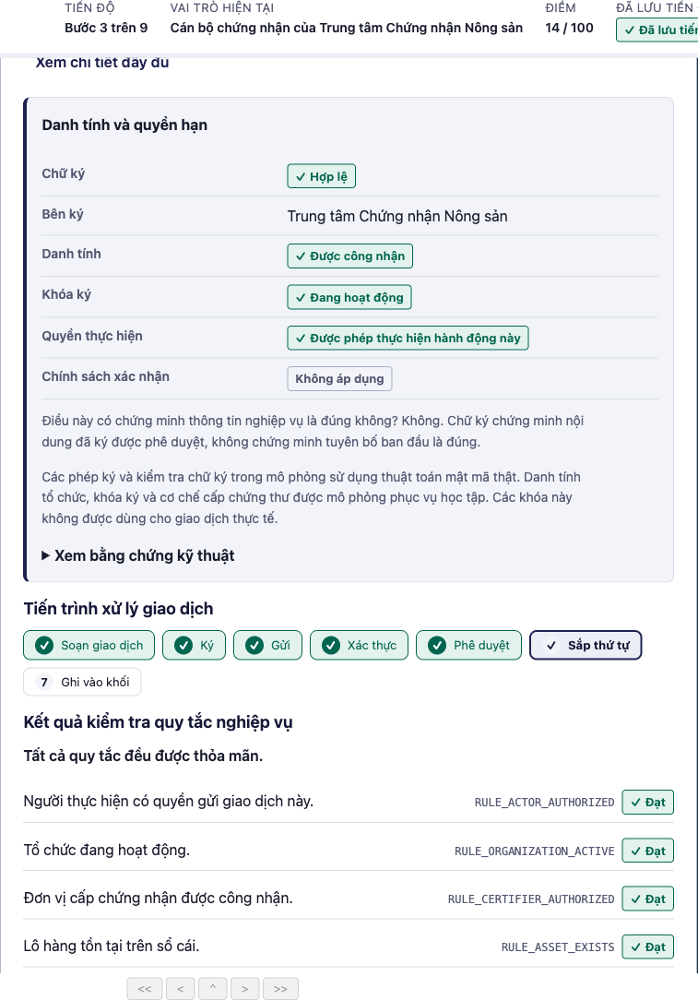

Các bản ghi được chấp nhận:

- `TX_000002` / `BLK_000002`: ghi nhận tài liệu
- `TX_000003` / `BLK_000003`: cấp chứng nhận
- mã bản ghi tài liệu: `DOC_QUALITY_CERTIFICATE_001`

Quyết định nghiệp vụ ban đầu ảnh hưởng đến bằng chứng thu hồi sau này. Trong
lượt học này, chứng nhận có thể được sử dụng mà không cần xem xét thủ công bổ
sung.

### Lý thuyết cần nhấn mạnh

Yêu cầu người học phát biểu riêng từng kết luận:

1. Chữ ký hợp lệ.
2. Danh tính học tập của bên ký được công nhận.
3. Khóa ký đang hoạt động.
4. Vai trò có hoặc không có thẩm quyền thực hiện hành động.
5. Không kết luận nào ở trên chứng minh tuyên bố ban đầu trong chứng nhận là
   đúng sự thật.

## Bước 4 — Chuyển quyền lưu giữ và giám sát vận chuyển

### Trạng thái ban đầu và bàn giao vai trò

Khi bắt đầu bước:

- tài sản: `BAT_GREEN_COFFEE_001`
- số lượng: 100 kg
- phiên bản: 3
- vòng đời: đã chứng nhận
- chủ sở hữu và bên lưu giữ: Hợp tác xã Cà phê Cao nguyên

Kịch bản bàn giao công việc từ **Nguyễn Thị Mai** tại hợp tác xã sang **Phạm
Quốc Huy**, điều phối viên logistics tại Công ty Vận tải Liên Việt.

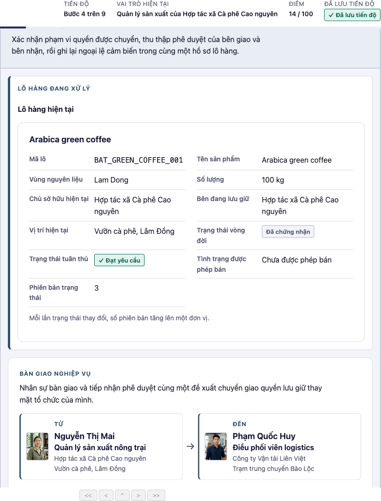

### Quyền lưu giữ và quyền sở hữu

Phán đoán đúng là:

- quyền lưu giữ chuyển cho đơn vị vận tải
- quyền sở hữu vẫn thuộc hợp tác xã

Điều này được thực thi bởi
`RULE_OWNERSHIP_UNCHANGED_ON_CUSTODY_TRANSFER`.

### Chính sách xác nhận

Đề xuất chuyển quyền lưu giữ yêu cầu:

```text
Bên đang lưu giữ AND Bên nhận lưu giữ
```

Hợp tác xã ký chính xác đề xuất trước. Một bước bàn giao vai trò tin cậy sau đó
cho phép đơn vị vận tải kiểm tra và ký cùng mã băm đề xuất và cùng phiên bản
trạng thái dự kiến. Một tổ chức không thể ký hai lần để thay thế cả hai bên.

Chính sách dạy một nguyên tắc nghiệp vụ: tuyên bố đơn phương của bên gửi không
đủ để chứng minh bên nhận đã tiếp nhận quyền lưu giữ.

Kết quả được chấp nhận:

- `TX_000004` / `BLK_000004`
- chủ sở hữu: hợp tác xã
- bên lưu giữ: đơn vị vận tải
- vị trí: trạm trung chuyển Bảo Lộc
- trạng thái: đang vận chuyển

### Bằng chứng cảm biến và giới hạn của oracle

Độ ẩm quan sát được là **72%**, cao hơn ngưỡng **70%** trong kịch bản.

Hành động tương xứng là:

- ghi nhận việc vượt ngưỡng
- đánh dấu lô cần kiểm tra
- giữ bộ dữ liệu cảm biến đầy đủ ngoài chuỗi
- ghi hàm băm của bộ dữ liệu lên chuỗi

Việc vượt ngưỡng là bằng chứng cần điều tra, không phải bằng chứng chắc chắn rằng
cà phê đã hỏng. Oracle đưa dữ liệu bên ngoài vào hệ thống giao dịch; blockchain
không tự đo độ ẩm hoặc chứng minh cảm biến đã được hiệu chuẩn.

Kết quả điều kiện vận chuyển được chấp nhận:

- `TX_000006` / `BLK_000006`
- tổ chức: Công ty Vận tải Liên Việt
- trạng thái tuân thủ: cần kiểm tra

Vận đơn được tạo trong bước:

- `TX_000005` / `BLK_000005`
- tổ chức: Hợp tác xã Cà phê Cao nguyên

### Câu hỏi thảo luận

> Cần thêm bằng chứng nào để phân biệt sự cố độ ẩm thật với cảm biến hỏng, hiệu
> chuẩn kém hoặc lỗi nhập dữ liệu?

## Bước 5 — Tiếp nhận lô và điều chỉnh chênh lệch số lượng

### Vai trò và chênh lệch

Người học đóng vai **Lê Thu Hà**, quản lý tiếp nhận tại Nhà máy Rang xay An Việt.

Vận đơn trên sổ cái ghi **1.000 kg**; lô vật lý cân được **100 kg**.

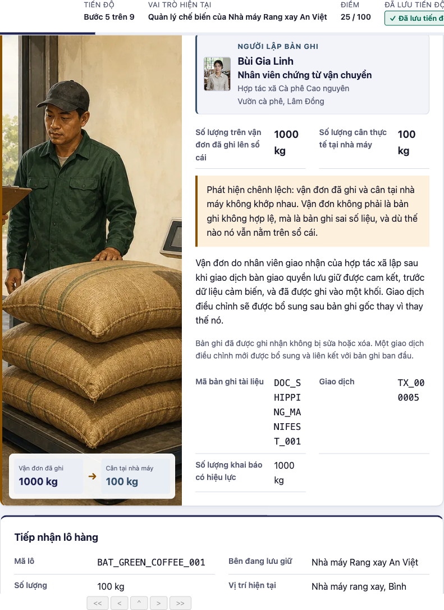

Bằng chứng liên quan:

- tài liệu gốc: `DOC_SHIPPING_MANIFEST_001`
- giao dịch gốc: `TX_000005`
- người ghi ban đầu: Bùi Gia Linh, nhân viên chứng từ vận tải
- phiếu cân nguồn: 100 kg
- nhật ký nhập: 1.000 kg
- cả hai bản ghi đều dùng kg, nên đây không phải lỗi đổi đơn vị
- niêm phong nguyên vẹn
- cân tại nhà máy xác nhận 100 kg
- hiện chưa có bằng chứng cho thấy thất thoát hoặc gian lận

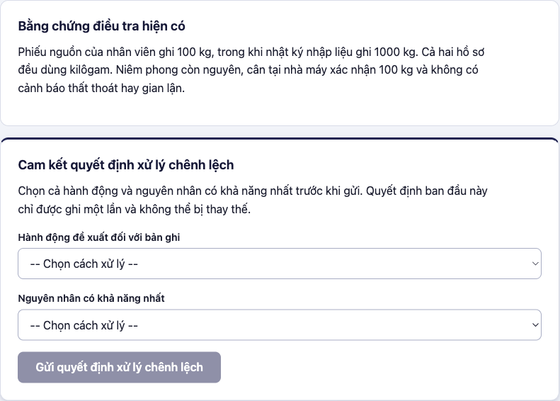

### Quyết định ban đầu đúng

Lựa chọn được biên soạn tốt nhất là:

```text
Điều tra, sau đó ghi thêm giao dịch điều chỉnh có liên kết
Nguyên nhân: lỗi đánh máy
```

Người học không được xóa, ghi đè hoặc âm thầm thay thế bản ghi gốc.

Nội dung điều chỉnh được gửi:

| Trường | Giá trị |
|---|---|
| Đích điều chỉnh | `DOC_SHIPPING_MANIFEST_001.declaredQuantity` |
| Giao dịch được tham chiếu | `TX_000005` |
| Giá trị gốc | 1.000 kg |
| Giá trị điều chỉnh | 100 kg |
| Lý do | “Cân lại tại nhà máy cho kết quả 100 kg, không phải 1000 kg như trên vận đơn.” |
| Độ dài lý do tối đa được lưu | 240 byte UTF-8 |

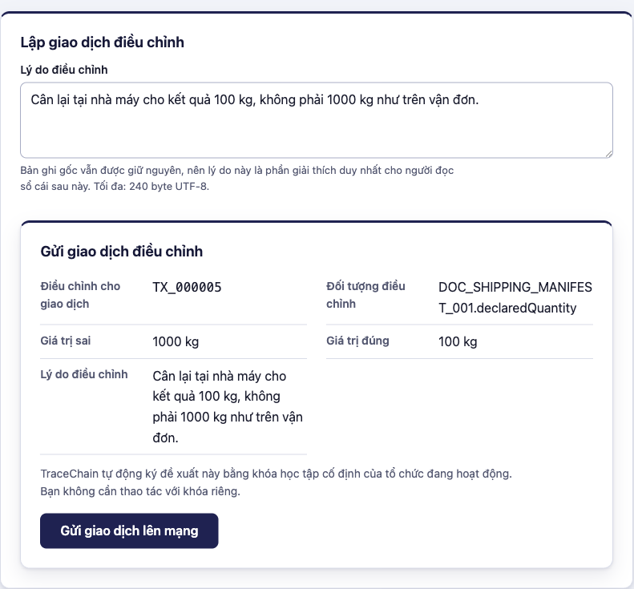

### Xác nhận giao dịch điều chỉnh

Chính sách yêu cầu:

```text
Nhà sản xuất AND Đơn vị chế biến
```

Nhà máy đề xuất và ký giao dịch điều chỉnh. Hợp tác xã sau đó xem xét và xác
nhận đúng cùng mã băm và phiên bản trạng thái dự kiến. Nếu hai bên ký nội dung
khác nhau, chính sách không được đáp ứng.

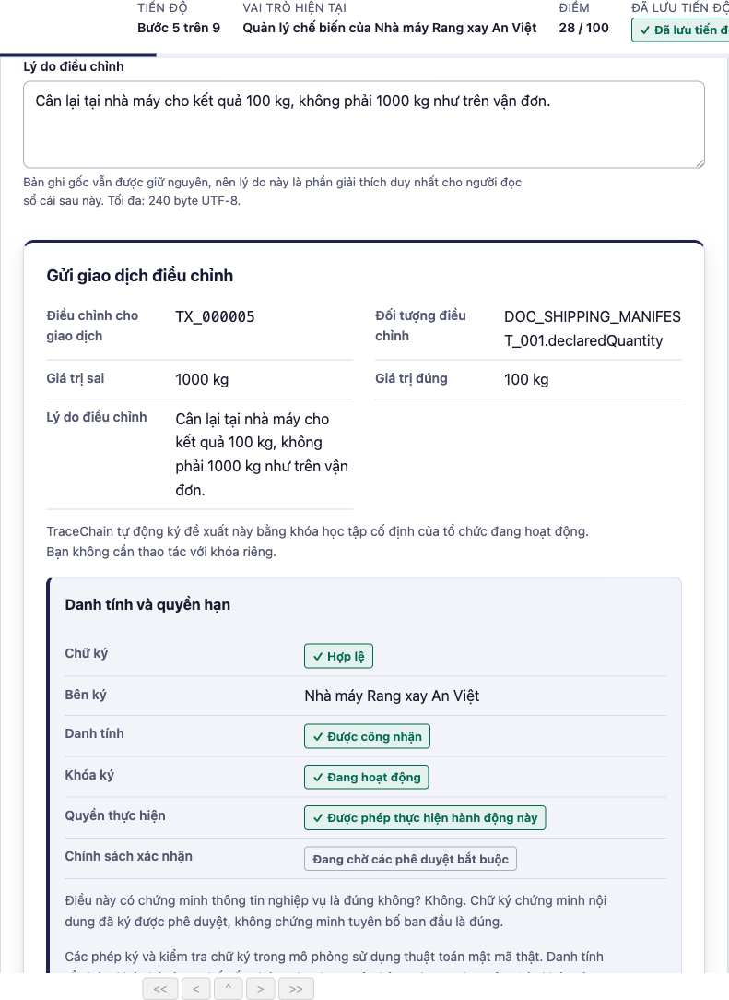

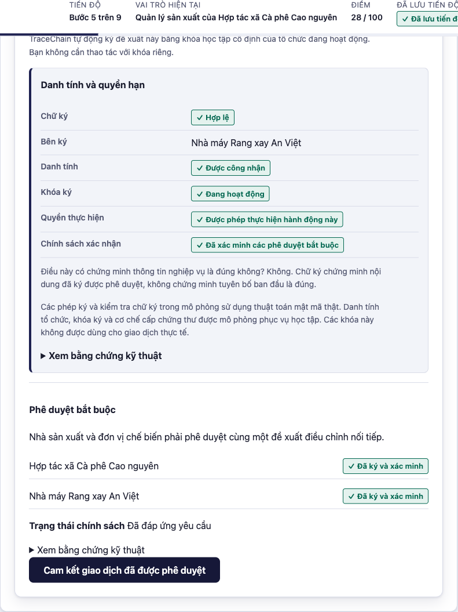

### Kết quả được chấp nhận

- `TX_000007` / `BLK_000007`: tiếp nhận lô
- `TX_000008` / `BLK_000008`: chuyển quyền sở hữu cho nhà máy
- `TX_000009` / `BLK_000009`: điều chỉnh chỉ ghi thêm

Lịch sử vẫn là:

```text
Số lượng khai báo ban đầu: 1.000 kg
Điều chỉnh sau đó: 100 kg
Số lượng khai báo có hiệu lực: 100 kg
```

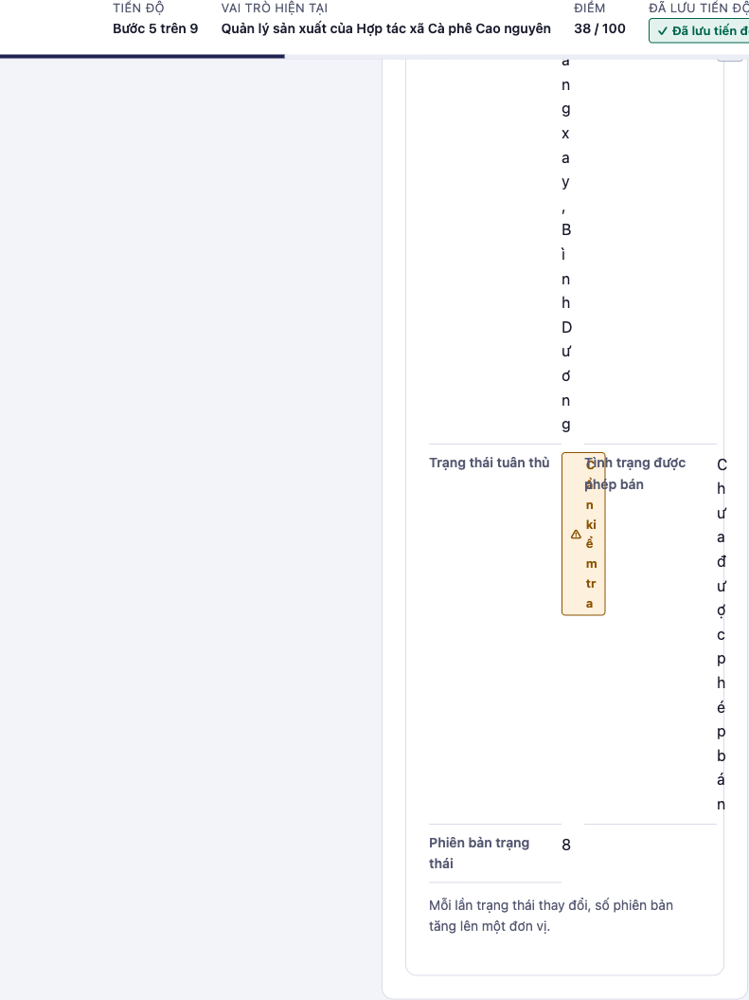

Sau bước này, nhà máy sở hữu và lưu giữ lô cà phê nhân. Số lượng có hiệu lực là
100 kg và lỗi ban đầu vẫn có thể được kiểm toán.

### Lý thuyết cần nhấn mạnh

Tính bất biến không có nghĩa là “không bao giờ được sửa lỗi”. Nó có nghĩa là
lịch sử đã được chấp nhận không bị âm thầm viết lại. Giao dịch điều chỉnh là một
sự kiện sau, có liên kết, làm thay đổi giá trị có hiệu lực nhưng vẫn giữ tuyên
bố ban đầu và nguồn gốc của nó.

## Bước 6 — Chuyển đổi cà phê nhân thành cà phê rang

### Bằng chứng cân bằng khối lượng

Người học ghi:

```text
100 kg cà phê nhân
→ 82 kg cà phê rang
→ hao hụt rang 18 kg
```

Giao dịch kiểm tra cân bằng khối lượng bằng đơn vị cơ sở tương thích và yêu cầu
đầu ra không vượt quá đầu vào hiện có.

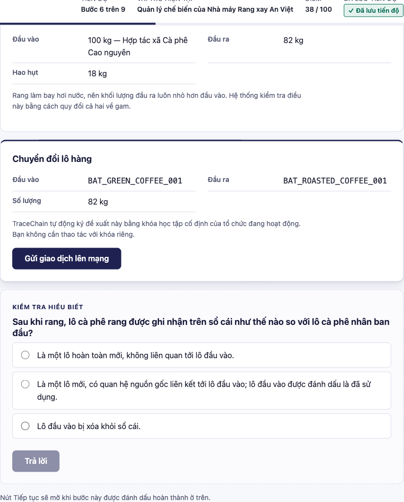

### Kết quả được chấp nhận

- đầu vào: `BAT_GREEN_COFFEE_001`
- đầu ra: `BAT_ROASTED_COFFEE_001`
- `TX_000010` / `BLK_000010`

Tài sản đầu vào không bị xóa. Nó chuyển sang trạng thái đã dùng để chuyển đổi và
lô rang mới được liên kết với nó bằng quan hệ nguồn gốc.

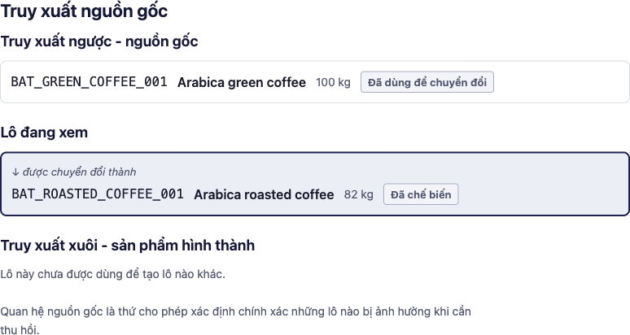

### Lý thuyết cần nhấn mạnh

Khả năng truy xuất phụ thuộc vào việc giữ quan hệ giữa đầu vào và đầu ra. Nếu
ứng dụng chỉ đổi tên lô nhân thành cà phê rang, lịch sử chuyển đổi sẽ mất và hệ
thống không thể truy xuất xuôi hoặc ngược đáng tin cậy.

## Bước 7 — Đóng gói, chuyển quyền sở hữu và giao hàng

### Tính toán đóng gói

```text
82 kg = 82.000 g
82.000 g ÷ 100 g mỗi gói = 820 gói
```

Tài sản đầu ra:

- `BAT_PACKAGED_COFFEE_001`
- Cà phê Arabica Lâm Đồng 100 g
- 820 gói

### Trình tự nghiệp vụ

1. Đóng gói lô cà phê rang.
2. Chuyển quyền sở hữu cho Nhà phân phối Thành Công trong khi quyền lưu giữ vẫn
   ở nhà máy.
3. Giao đến Siêu thị Việt Market tại Quận 1, thay đổi quyền lưu giữ và quyền sở
   hữu theo kịch bản.

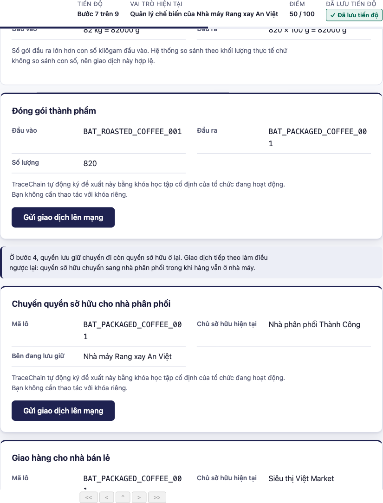

Các giao dịch được chấp nhận:

- `TX_000011` / `BLK_000011`: đóng gói
- `TX_000012` / `BLK_000012`: chuyển quyền sở hữu
- `TX_000013` / `BLK_000013`: giao hàng

Trước sự cố thu hồi, lô thành phẩm có:

- chủ sở hữu: Siêu thị Việt Market
- bên lưu giữ: Siêu thị Việt Market
- vị trí: Quận 1
- vòng đời: được phép bán
- số lượng: 820 gói
- phiên bản: 3
- ghi chú tuân thủ kế thừa từ bằng chứng vận chuyển: cần kiểm tra

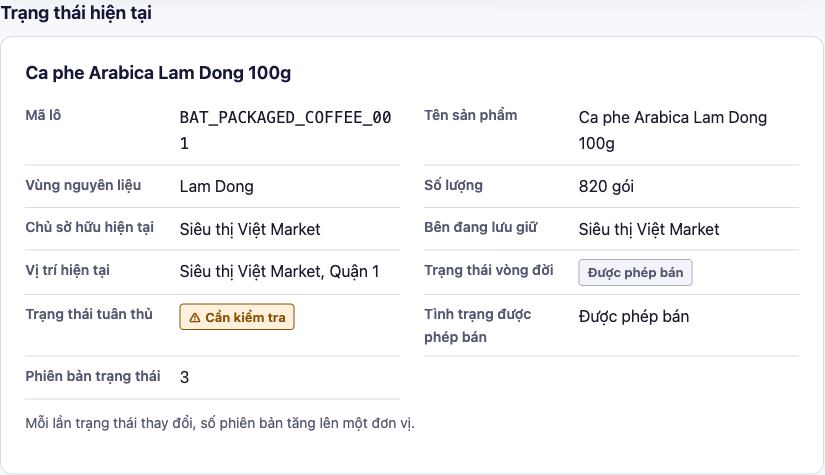

### Bằng chứng tham chiếu sau phân phối

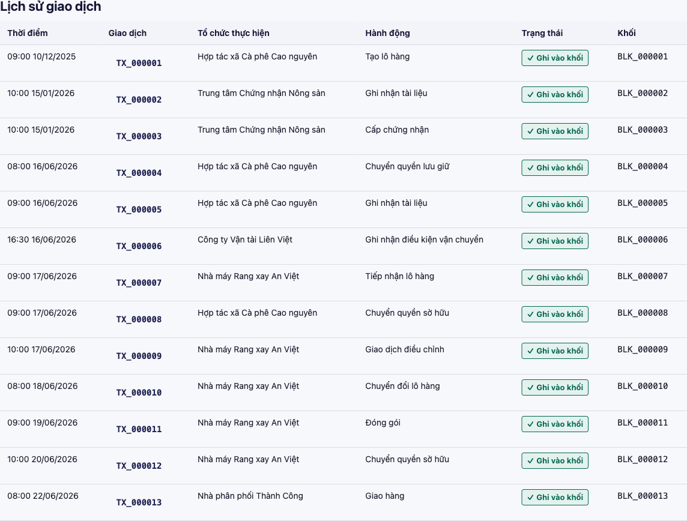

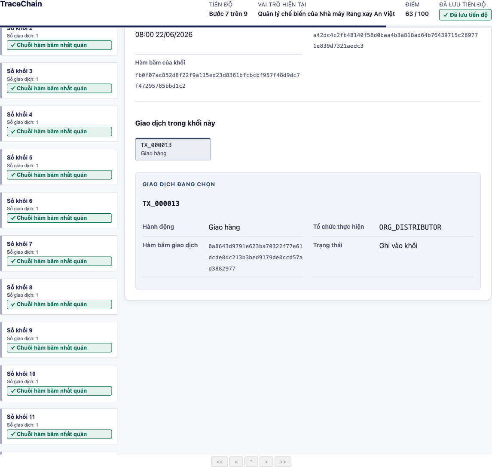

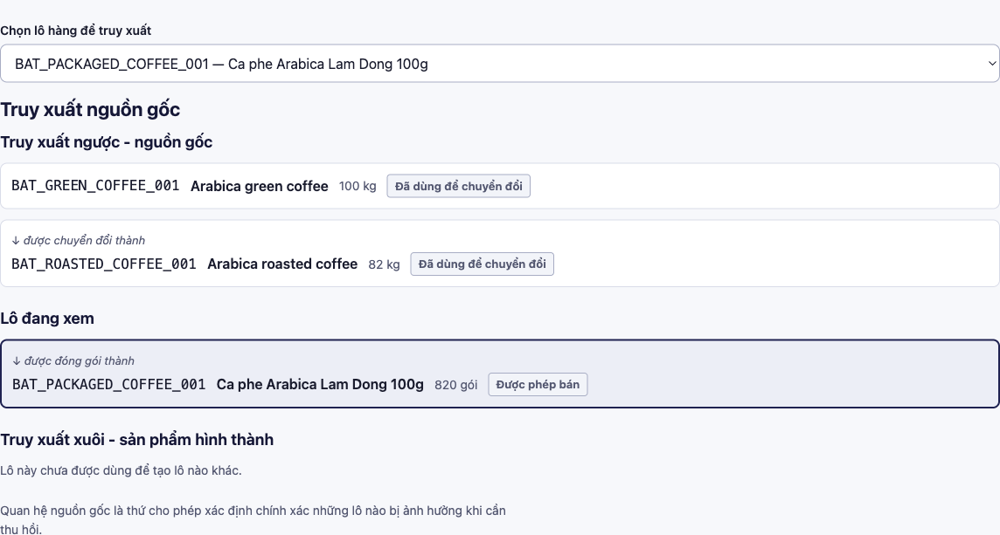

### Lý thuyết cần nhấn mạnh

Quyền sở hữu, quyền lưu giữ, vị trí và trạng thái vòng đời là các thuộc tính khác
nhau. Một sản phẩm có thể thuộc sở hữu của một tổ chức nhưng do tổ chức khác lưu
giữ. Đồng nhất các khái niệm này làm suy yếu trách nhiệm khi xảy ra mất mát,
kiểm tra hoặc thu hồi.

## Bước 8 — Kiểm tra nguồn gốc, phát hiện sửa đổi và quản trị dữ liệu

### Kiểm tra tính toàn vẹn sổ cái

Người học thấy cả 13 khối đều có chuỗi hàm băm nhất quán. Sổ cái giải thích rằng
các giá trị SHA-256 được tính từ bản ghi, không phải ví dụ được viết sẵn.

### Thử nghiệm sửa giao dịch và khối trên bản sao

Thử nghiệm chạy trên một bản sao và không làm thay đổi sổ cái của người học.

1. Đổi số lượng trong `TX_000001` từ 100 thành 1. Giao dịch không còn khớp với
   hàm băm của chính nó.
2. Tính lại hàm băm giao dịch. Giao dịch trở nên nhất quán nội bộ, nhưng
   `BLK_000001` vẫn cam kết theo hàm băm giao dịch cũ.
3. Tính lại khối đầu tiên. Khối kế tiếp vẫn chứa hàm băm khối trước cũ, vì vậy
   liên kết chuỗi bị đứt.

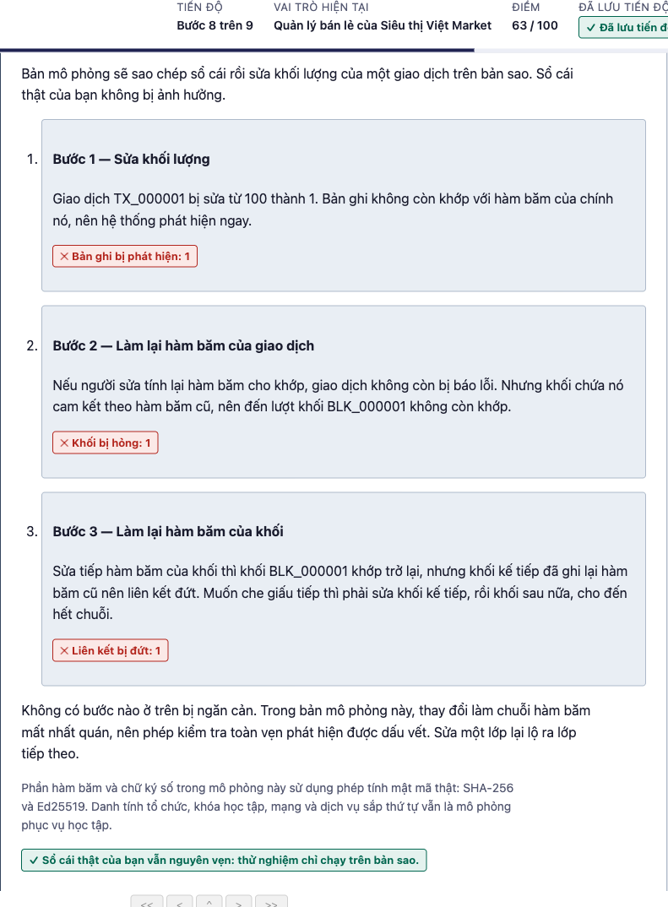

Kết luận đúng:

> Blockchain không ngăn ai đó sửa một bản sao. Việc sửa làm chuỗi hàm băm mất
> nhất quán và có thể bị phát hiện khi kiểm tra tính toàn vẹn.

### Thử nghiệm sửa nội dung đã ký

Thử nghiệm Ed25519 tùy chọn kiểm tra một đề xuất gốc đã ký, thay đổi một ký tự,
tính lại mã băm đề xuất và kiểm tra nội dung mới bằng chữ ký ban đầu.

Các mã băm quan sát được:

- đề xuất gốc:
  `4f29b16189c3060e49b23e2784ca47866df18b1f2da1df5d0c554fad178edd1c`
- đề xuất đã sửa:
  `5b188d04db50b9f7ad4558544ea3055116441aa93c361274aa6e8879038039ba`

Chữ ký ban đầu hợp lệ với mã băm thứ nhất nhưng không xác minh được mã băm thứ
hai.

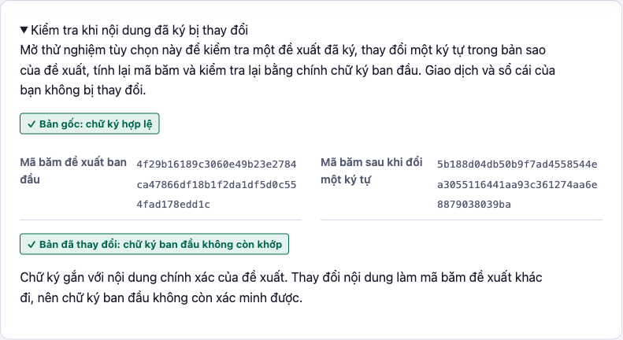

### Phân loại quản trị dữ liệu

Quy tắc của liên minh trong tình huống:

- mã định danh và trạng thái ổn định mà mọi thành viên cần dùng được ghi trên
  chuỗi
- tệp nguồn và bộ dữ liệu lớn ở ngoài chuỗi, SHA-256 của chúng ở trên chuỗi
- dữ liệu thương mại nhạy cảm nhưng cần thiết chỉ được chia sẻ cho bên có quyền
- dữ liệu cá nhân không cần thiết thì không được thu thập

Phân loại đúng:

| Mục dữ liệu | Cách xử lý |
|---|---|
| Mã lô hàng | Ghi trên chuỗi |
| Tình trạng thu hồi | Ghi trên chuỗi |
| Tệp PDF chứng nhận đầy đủ | Ngoài chuỗi; hàm băm trên chuỗi |
| Bộ dữ liệu cảm biến đầy đủ | Ngoài chuỗi; hàm băm trên chuỗi |
| Giá bán buôn | Chỉ các bên được cấp quyền |
| Địa chỉ nhà của người tiêu dùng | Không thu thập cho mục đích này |

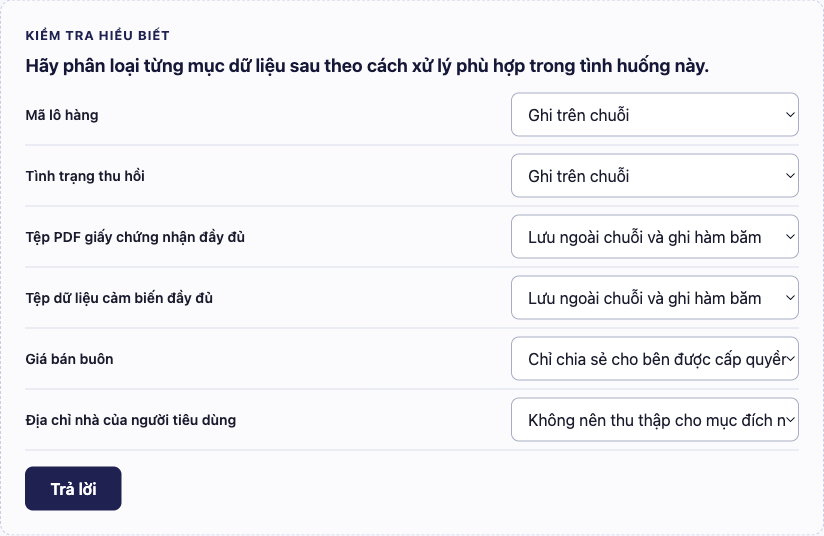

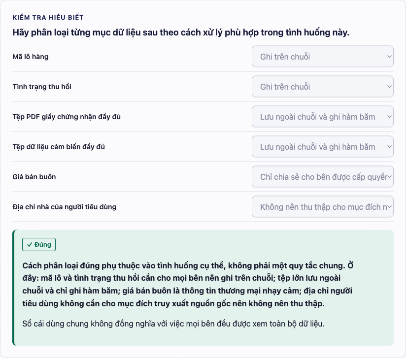

### Lý thuyết cần nhấn mạnh

Sổ cái dùng chung không có nghĩa mọi thành viên phải đọc được mọi trường dữ
liệu. Tính toàn vẹn, bảo mật, tối thiểu hóa dữ liệu và kiểm soát truy cập giải
quyết các vấn đề khác nhau. “Đưa mọi thứ lên chuỗi” không phải chính sách quản
trị hợp lý.

## Bước 9 — Truy xuất và thu hồi sản phẩm bị ảnh hưởng

### Sự cố

Phòng thí nghiệm phát hiện dư lượng thuốc bảo vệ thực vật vượt ngưỡng cho phép
trong `BAT_GREEN_COFFEE_001`.

Ban đầu, người học đóng vai **Võ Thanh Nam**, quản lý vận hành bán lẻ tại Siêu
thị Việt Market.

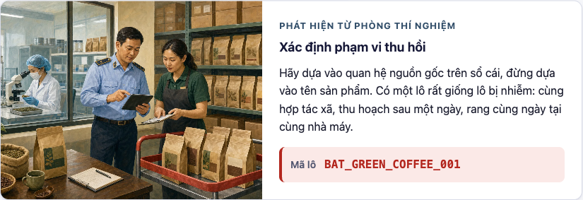

### Bằng chứng tại thời điểm quyết định

| Bằng chứng | Giá trị |
|---|---|
| Lô nguồn bị nhiễm | `BAT_GREEN_COFFEE_001` |
| Rủi ro người tiêu dùng | Cao; thành phẩm đã ở điểm bán |
| Độ mạnh bằng chứng thu hồi ban đầu | Trung bình |
| Tổ chức đang xử lý | Siêu thị Việt Market |
| Số lô hậu duệ theo nguồn gốc | 2 |
| Lô rang hậu duệ | `BAT_ROASTED_COFFEE_001`, 82 kg |
| Lô đóng gói hậu duệ | `BAT_PACKAGED_COFFEE_001`, 820 gói |

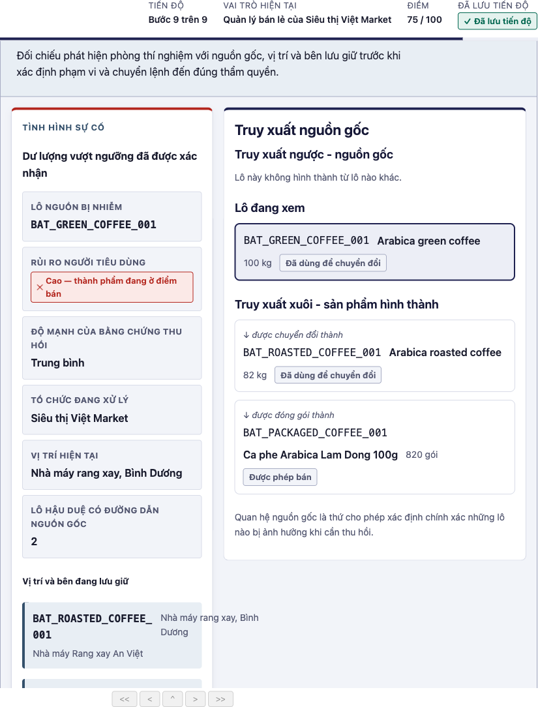

### Phạm vi đúng

Chọn:

- `BAT_ROASTED_COFFEE_001`
- `BAT_PACKAGED_COFFEE_001`

Không chọn:

- `BAT_PACKAGED_COFFEE_002`, dù sản phẩm, nhà sản xuất, ngày rang và nhà máy rất
  giống
- `BAT_PACKAGED_COFFEE_003`, sản phẩm Robusta không liên quan

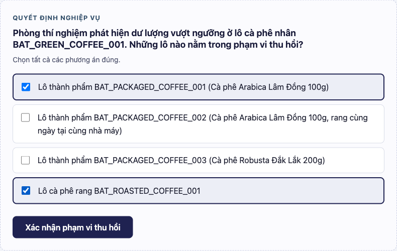

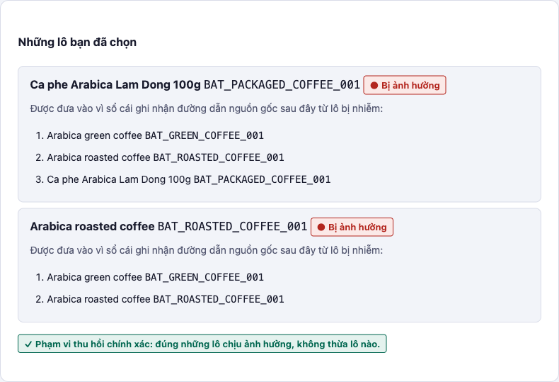

Phân biệt quan trọng:

```text
Giống nhau không có nghĩa là có quan hệ nguồn gốc.
```

Thu hồi quá hẹp để lại sản phẩm bị ảnh hưởng cho người tiêu dùng. Thu hồi quá
rộng phá hủy sản phẩm không bị ảnh hưởng và tạo chi phí vận hành không cần
thiết.

### Bàn giao thẩm quyền tin cậy

Nhà bán lẻ có thể xác định và đề xuất phạm vi nhưng không có thẩm quyền cam kết
lệnh thu hồi theo quy định. Kịch bản cung cấp bước bàn giao rõ ràng từ Võ Thanh
Nam sang **Đặng Ngọc Lan**, chuyên viên thu hồi của Cơ quan Quản lý An toàn Thực
phẩm.

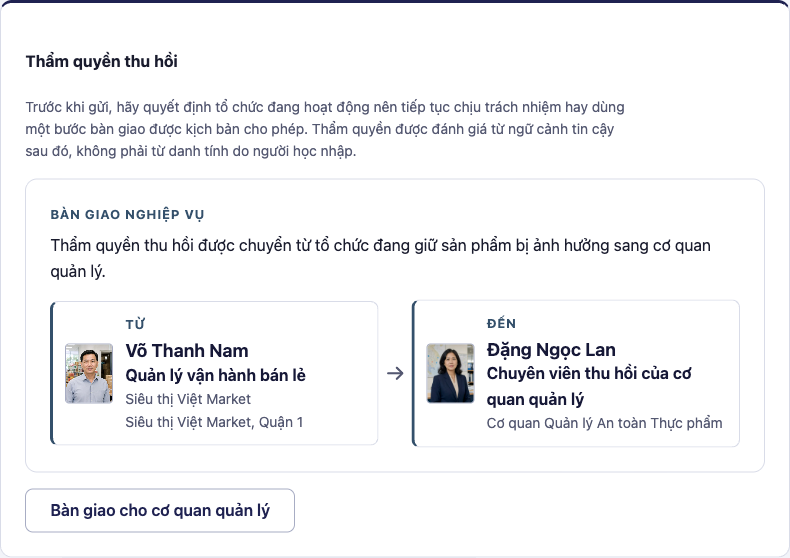

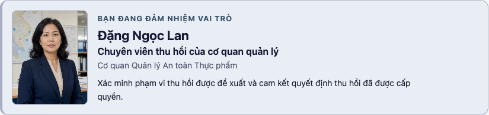

Nội dung lệnh không chứa danh tính do người học nhập. Bộ điều phối lấy người
thực hiện, tổ chức và vai trò từ ngữ cảnh tin cậy đang hoạt động.

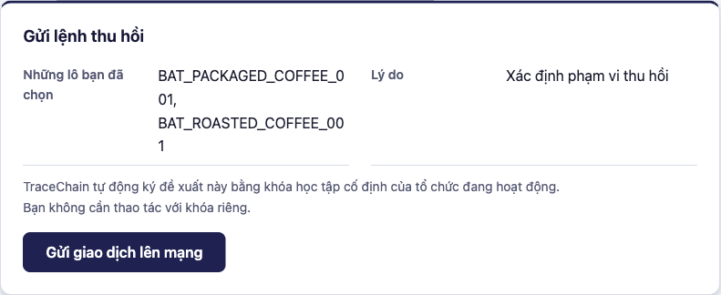

Nếu người học gửi khi vẫn đóng vai nhà bán lẻ, hệ thống tạo sự kiện kiểm toán
lần thử và không làm thay đổi sổ cái. Phạm vi và bằng chứng vẫn có thể được tính
điểm và thảo luận; sau đó người học phải hoàn thành bàn giao cho cơ quan quản lý
và gửi lại đúng thẩm quyền trước khi hoàn thành bước.

### Chữ ký, kiểm tra và cam kết

Trong ngữ cảnh cơ quan quản lý:

- chữ ký Ed25519: hợp lệ
- bên ký: Cơ quan Quản lý An toàn Thực phẩm
- danh tính: được công nhận
- khóa: đang hoạt động
- hành động: được phép
- chính sách xác nhận: không áp dụng

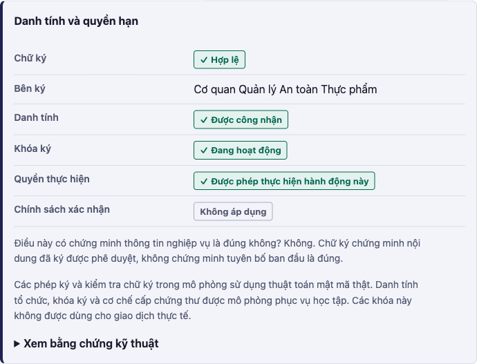

Đề xuất đạt các quy tắc về thẩm quyền, tổ chức, tài sản tồn tại và thời điểm; sau
đó được sắp thứ tự. Người học còn phải thực hiện hành động cam kết riêng **Ghi
giao dịch vào khối**.

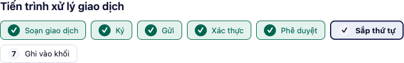

Các quyết định trước được tái dựng thay vì lưu các giá trị dẫn xuất có thể mâu
thuẫn:

- độ mạnh bằng chứng thu hồi: mạnh
- số bản ghi cần xem xét thủ công: 0

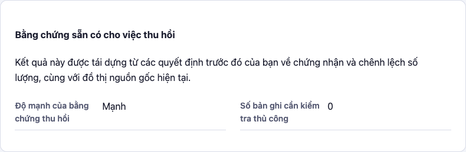

Sau khi cam kết:

- `TX_000014`
- `BLK_000014`
- thời điểm sắp thứ tự: 11:00, ngày 5 tháng 7 năm 2026
- tổ chức: `ORG_REGULATOR`
- SHA-256 giao dịch:
  `39262492fe519166b526f812108b11c9744cbc7a51104011ffe21bcdff739cd5`
- SHA-256 khối trước:
  `fb0f07ac852d8f22f9a115ed23d8361bfcbcbf957f48d9dc7f47295785bbd1c2`
- SHA-256 khối thu hồi:
  `e51682adfa6201c0a97c84e7e202b639ff4845320b9a9840c6625cd5eb621f0c`

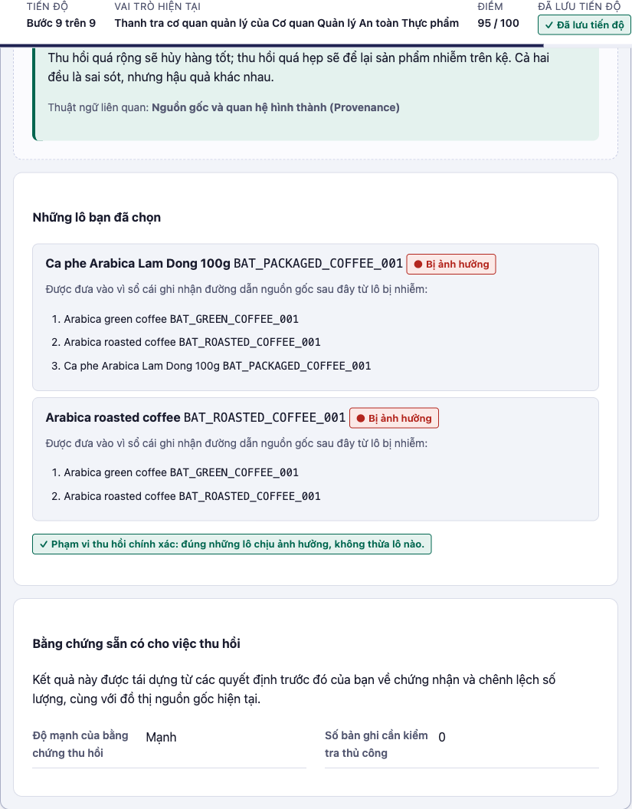

### Câu hỏi khái niệm cuối

Blockchain có cơ sở áp dụng rõ hơn cơ sở dữ liệu tập trung khi:

> nhiều tổ chức độc lập cần dùng chung bản ghi nhưng không muốn một tổ chức kiểm
> soát toàn bộ hệ thống.

Nếu chỉ một tổ chức sở hữu và kiểm soát dữ liệu, cơ sở dữ liệu thông thường
thường đơn giản, nhanh và rẻ hơn. Blockchain cũng không bảo đảm dữ liệu được nhập
vào là đúng sự thật.

## 7. Toàn bộ sổ cái đã được chấp nhận

| Thời điểm | Giao dịch | Tổ chức | Hành động | Khối |
|---|---|---|---|---|
| 09:00 10/12/2025 | `TX_000001` | Hợp tác xã Cà phê Cao nguyên | Tạo lô hàng | `BLK_000001` |
| 10:00 15/01/2026 | `TX_000002` | Trung tâm Chứng nhận Nông sản | Ghi nhận tài liệu | `BLK_000002` |
| 10:00 15/01/2026 | `TX_000003` | Trung tâm Chứng nhận Nông sản | Cấp chứng nhận | `BLK_000003` |
| 08:00 16/06/2026 | `TX_000004` | Hợp tác xã Cà phê Cao nguyên | Chuyển quyền lưu giữ | `BLK_000004` |
| 09:00 16/06/2026 | `TX_000005` | Hợp tác xã Cà phê Cao nguyên | Ghi nhận vận đơn | `BLK_000005` |
| 16:30 16/06/2026 | `TX_000006` | Công ty Vận tải Liên Việt | Ghi nhận điều kiện vận chuyển | `BLK_000006` |
| 09:00 17/06/2026 | `TX_000007` | Nhà máy Rang xay An Việt | Tiếp nhận lô hàng | `BLK_000007` |
| 09:00 17/06/2026 | `TX_000008` | Hợp tác xã Cà phê Cao nguyên | Chuyển quyền sở hữu | `BLK_000008` |
| 10:00 17/06/2026 | `TX_000009` | Nhà máy Rang xay An Việt | Giao dịch điều chỉnh | `BLK_000009` |
| 08:00 18/06/2026 | `TX_000010` | Nhà máy Rang xay An Việt | Chuyển đổi lô hàng | `BLK_000010` |
| 09:00 19/06/2026 | `TX_000011` | Nhà máy Rang xay An Việt | Đóng gói | `BLK_000011` |
| 10:00 20/06/2026 | `TX_000012` | Nhà máy Rang xay An Việt | Chuyển quyền sở hữu | `BLK_000012` |
| 08:00 22/06/2026 | `TX_000013` | Nhà phân phối Thành Công | Giao hàng | `BLK_000013` |
| 11:00 05/07/2026 | `TX_000014` | Cơ quan Quản lý An toàn Thực phẩm | Thu hồi | `BLK_000014` |

Chỉ các sự kiện làm thay đổi sổ cái đã được chấp nhận mới xuất hiện trong bảng.
Việc tạo đề xuất, thu thập xác nhận, bàn giao vai trò, quyết định và lần thử bị
từ chối vẫn có thể được phát lại và báo cáo nhưng không bị trình bày sai như
giao dịch sổ cái.

## 8. Trạng thái hiện tại cuối

Ba tài sản trong dòng nguồn gốc bị ảnh hưởng đều đã thu hồi và không được phép
bán:

| Tài sản | Số lượng | Chủ sở hữu / bên lưu giữ | Vòng đời cuối | Phiên bản cuối |
|---|---:|---|---|---:|
| `BAT_GREEN_COFFEE_001` | 100 kg | Nhà máy Rang xay An Việt | Đã thu hồi | 10 |
| `BAT_ROASTED_COFFEE_001` | 82 kg | Nhà máy Rang xay An Việt | Đã thu hồi | 3 |
| `BAT_PACKAGED_COFFEE_001` | 820 gói | Siêu thị Việt Market | Đã thu hồi | 4 |

Các tài sản gây nhiễu không bị ảnh hưởng và vẫn được phép bán nếu kịch bản quy
định như vậy.

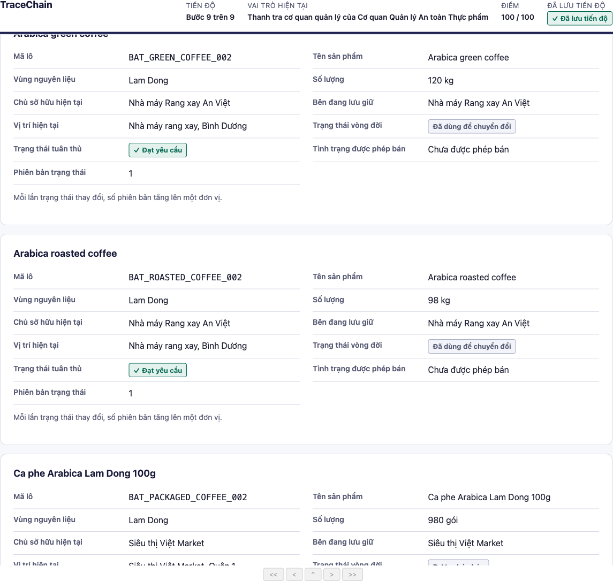

Đây là ví dụ quan trọng về phiên bản trạng thái: một lệnh thu hồi được chấp nhận
ảnh hưởng nhiều tài sản đang tồn tại, và mỗi tài sản bị ảnh hưởng chỉ tăng phiên
bản đúng một lần.

## 9. Báo cáo cuối và diễn giải nhân quả

### Kết quả học thuật


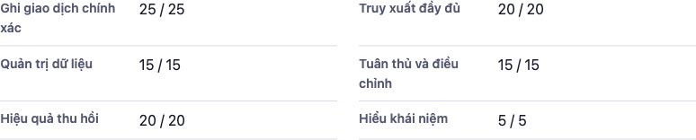

Vận đơn 1.000 kg ban đầu vẫn hiển thị cùng với giá trị điều chỉnh có hiệu lực
100 kg.

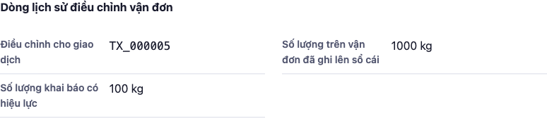

### Các khía cạnh chẩn đoán

Các khía cạnh này giải thích hệ quả của quyết định. Chúng không tạo ra điểm thứ
hai cạnh tranh với điểm học thuật.

| Khía cạnh | Kết quả |
|---|---:|
| Khả năng truy xuất | 100/100 |
| Tính toàn vẹn dữ liệu | 100/100 |
| Tuân thủ | 100/100 |
| An toàn người tiêu dùng | 100/100 |
| Hiệu quả vận hành | 100/100 |
| Chất lượng quản trị | 100/100 |
| Độ mạnh bằng chứng thu hồi | Mạnh |

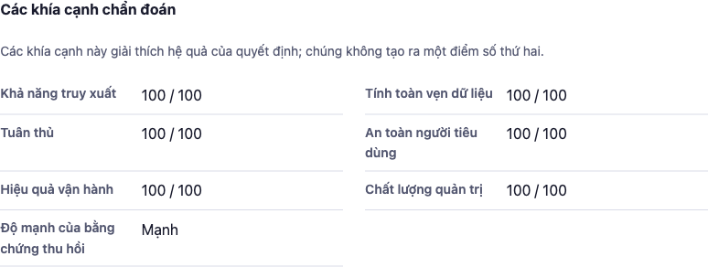

### Giải thích nhân quả được tạo từ lượt học

Báo cáo cuối nêu:

1. Việc xác minh chứng nhận và đơn vị cấp ở Bước 3, cùng cách lưu tài liệu ngoài
   chuỗi và hàm băm trên chuỗi, giúp dùng lại bằng chứng ở Bước 9 mà không cần
   xem xét bổ sung.
2. Chữ ký hợp lệ nhưng không đúng thẩm quyền của đơn vị vận tải ở Bước 3 chỉ tạo
   bằng chứng kiểm toán.
3. Giao dịch chứng nhận chỉ cam kết sau khi kiểm tra chữ ký, danh tính, trạng
   thái khóa và quyền của vai trò.
4. Lệnh thu hồi chỉ cam kết sau khi kiểm tra chữ ký và thẩm quyền của cơ quan
   quản lý.
5. Chuyển quyền lưu giữ yêu cầu bên đang lưu giữ và bên nhận cùng xác nhận một
   đề xuất và phiên bản trạng thái.
6. Điều chỉnh số lượng yêu cầu nhà máy và nhà sản xuất cùng xác nhận một giao
   dịch điều chỉnh chỉ ghi thêm.
7. Giao dịch điều chỉnh có bằng chứng ở Bước 5 giữ cả giá trị vận đơn ban đầu và
   giá trị có hiệu lực để kiểm toán.
8. Phạm vi thu hồi ở Bước 9 đi đúng theo nguồn gốc, tránh bỏ sót lô bị ảnh hưởng
   và tránh thu hồi không cần thiết.
9. Lệnh thu hồi được cam kết trong ngữ cảnh tin cậy có thẩm quyền mà không cần
   gửi lại do lỗi phân quyền.

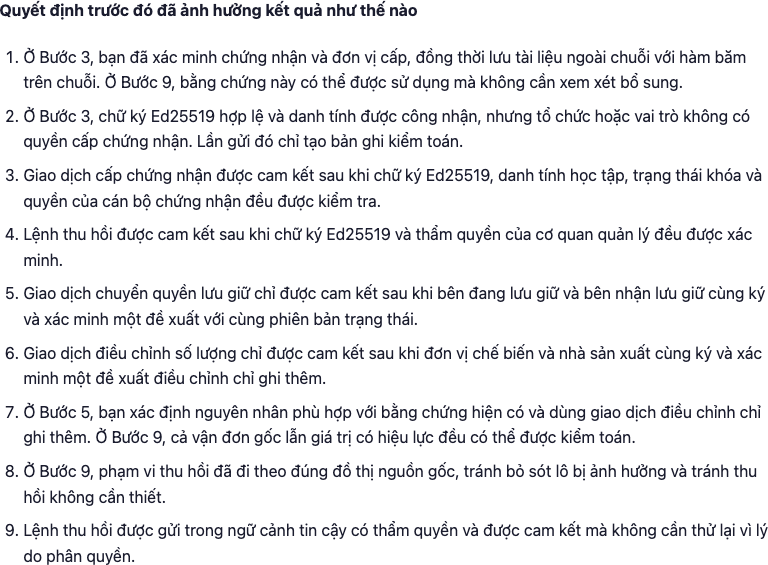

Tóm tắt lượt học:

- số gợi ý: 0
- giao dịch sổ cái bị từ chối: 0
- giao dịch được chấp nhận: 14
- số khối: 14
- bản ghi cần xem xét thủ công: 0
- kịch bản: `SCN_COFFEE_001@2.3.0`
- cấu hình:
  `c7c3c3236c7a2dae18aa8499dcef70df0a1a460b0a74e9bccec5f48490942a40`

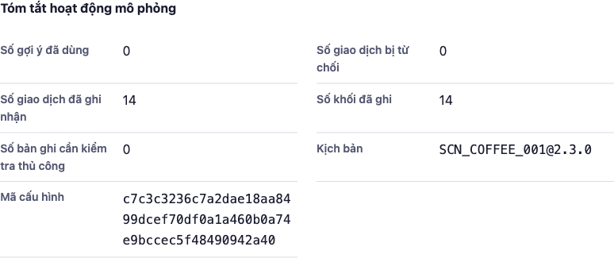


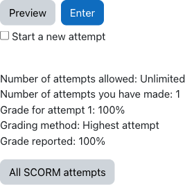

## 10. Gợi ý thảo luận trên lớp

### Tính toàn vẹn và tính đúng sự thật

- Kiểm tra nào ở Bước 3 hỗ trợ tính toàn vẹn?
- Bằng chứng nào hỗ trợ tính đúng sự thật của chứng nhận?
- Nếu một đơn vị chứng nhận được công nhận ký nội dung sai, những kiểm tra nào
  vẫn đạt?

### Xác thực và thẩm quyền

- Vì sao chữ ký thật của đơn vị vận tải vẫn bị từ chối?
- Điều gì nguy hiểm nếu cho người học tự nhập tổ chức ký vào nội dung lệnh?
- Vì sao trạng thái khóa là câu hỏi khác với thẩm quyền của tổ chức?

### Xác nhận

- Xác nhận của bên gửi và bên nhận ngăn tranh chấp nào?
- Vì sao hai tổ chức phải ký cùng một mã băm?
- Một chính sách xác nhận đã đạt có thể vẫn thất bại khi cam kết vì phiên bản
  tài sản đã thay đổi không?

### Điều chỉnh và khả năng kiểm toán

- Vì sao ghi đè vận đơn có vẻ hấp dẫn về mặt vận hành?
- Ghi đè làm mất bằng chứng nào?
- Giao dịch điều chỉnh chỉ ghi thêm phân biệt “điều đã được tuyên bố lúc đó” và
  “giá trị có hiệu lực hiện nay” như thế nào?

### Nguồn gốc và thu hồi

- Vì sao `BAT_PACKAGED_COFFEE_002` là phương án gây nhiễu mạnh?
- Thu hồi quá rộng tạo ra chi phí gì?
- Thu hồi quá hẹp tạo ra hậu quả an toàn nào?
- Những quyết định trước nào giúp phạm vi cuối dễ bảo vệ hơn?

### Trường hợp sử dụng blockchain phù hợp

- Quan hệ nào trong tình huống biện minh cho sổ cái dùng chung có cấp quyền?
- Dữ liệu nào phù hợp hơn với cơ sở dữ liệu hoặc kho tài liệu thông thường?
- Nếu liên minh chỉ có một tổ chức, phần nào của kiến trúc không còn cần thiết?

## 11. Lưu ý dành cho giảng viên

- Không trình bày nhánh hoàn hảo như cách ứng xử nghề nghiệp duy nhất. Mô phỏng
  cố ý hỗ trợ sai sót có giới hạn và khắc phục.
- Không nói blockchain ngăn việc chỉnh sửa. Nó làm cho thay đổi không được phép
  có thể bị phát hiện khi các bên kiểm tra tính toàn vẹn.
- Không nói chữ ký chứng minh sự thật. Chữ ký gắn một khóa học tập với nội dung
  chính xác.
- Không gọi xác nhận là “đồng thuận của mạng”. Đây là chính sách phê duyệt
  nghiệp vụ cho một đề xuất.
- Không ngụ ý mọi dữ liệu đều nên đưa lên chuỗi.
- Không kết luận lô hàng bị hỏng chỉ từ việc độ ẩm vượt ngưỡng ở Bước 4.
- Không xác định sản phẩm bị ảnh hưởng bằng tên hoặc ngày giống nhau; phải dùng
  quan hệ nguồn gốc.
- Giữ cả giá trị vận đơn ban đầu và giá trị có hiệu lực khi thảo luận.

## 12. Ghi chú về việc ghi hình và kiểm tra

- Hướng dẫn sử dụng trình duyệt Chromium thật và trình chạy SCORM đã triển khai
  trên Moodle tại `http://localhost:8080`.
- Kết quả đã được cam kết lên Moodle; trang hoạt động báo lượt 1 và điểm 100%.
- Ảnh chụp chỉ được cắt phần canvas trình duyệt trống; nội dung giao diện nhìn
  thấy không được vẽ lại hoặc tổng hợp.
- Lỗi duy nhất trong bảng điều khiển trình duyệt là yêu cầu giao diện Moodle
  `theme/yui_image.php?.../arrows.png` trả về 404. Không quan sát thấy lỗi ứng
  dụng TraceChain trong toàn bộ lượt học.
- Thư mục có 63 ảnh chụp, bao gồm một số trạng thái trung gian không được nhúng
  hết vào phần trình bày chính.
